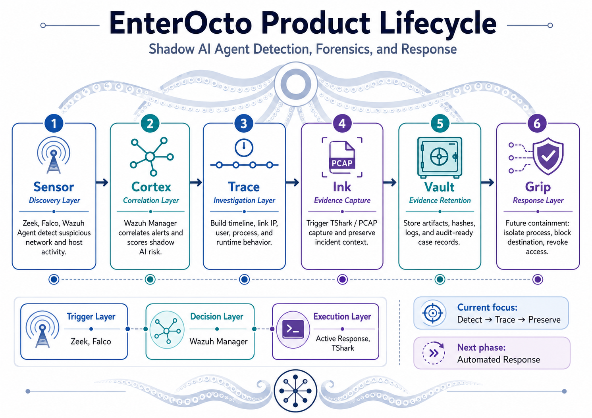
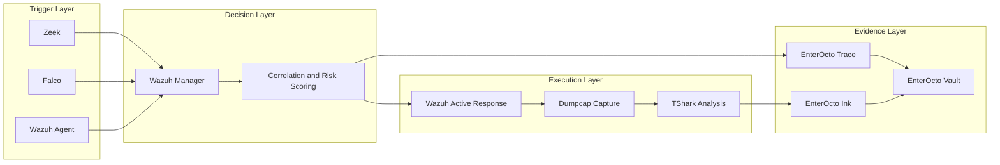

<div align="center">

# EnterOcto

### Shadow AI Agent Detection, Forensics, and Response

**Discover shadow AI agents, correlate runtime behavior, and preserve evidence before the trail disappears.**

</div>

<p align="center">
  <a href="LICENSE"></a>
  
  
</p>

<p align="center">
  
</p>

> [!IMPORTANT]
> EnterOcto is currently an early-stage open-source security research and engineering project.  
> The initial focus is **detection, investigation, and evidence preservation**. Automated containment is planned for a later phase.

## Overview

EnterOcto is an open-source security platform concept for detecting and investigating unauthorized, unmanaged, or high-risk AI agents operating inside enterprise environments.

The project combines network telemetry, host runtime events, correlation rules, automated evidence collection, and incident-ready case records.

The initial technical stack is built around:

- **Zeek** for network visibility and suspicious connection discovery
- **Falco** for Linux runtime and process behavior detection
- **Wazuh Agent / Manager** for telemetry collection, alert correlation, and risk decisions
- **Wazuh Active Response** for controlled response orchestration
- **Dumpcap** for bounded packet capture
- **TShark** for packet analysis and evidence inspection

EnterOcto is not intended to identify an application solely by its product name. It correlates network, process, identity, file-access, and runtime evidence to identify behavior consistent with shadow AI agents.

## About JoyYoungAI

JoyYoungAI is a company with an open-source integration engineering team focused
on assembling proven open-source components into secure, maintainable, and
operationally ready solutions.

We do not aim to replace upstream projects such as Zeek, Falco, Wazuh, or
Wireshark. Our work focuses on:

- architecture and integration design;
- secure orchestration and automation;
- deployment and upgrade workflows;
- interoperability and evidence handling;
- licensing and attribution boundaries;
- testing, operational documentation, and maintainability.

EnterOcto connects independently maintained security tools through clearly
defined interfaces while preserving each upstream project's original license,
copyright, trademark, and attribution requirements.

In practical terms, JoyYoungAI does not reinvent every wheel. We select proven
wheels, inspect them, connect them safely, add the controls and documentation,
and deliver an integration that can be operated and maintained.

## Licensing Model

The main **EnterOcto** repository is licensed under the
[Apache License 2.0](LICENSE).

EnterOcto is designed to interoperate with separately installed open-source
security tools. Their original licenses remain unchanged:

| Project | Upstream license | EnterOcto integration boundary |
|---|---|---|
| Zeek | BSD-style three-clause license | Logs, scripts and telemetry interfaces |
| Falco | Apache-2.0 | JSON/runtime telemetry and original EnterOcto rules |
| Wazuh | GPL-2.0 | Separate service and separate `EnterOcto-Wazuh` repository |
| Wireshark / TShark / Dumpcap | GPL-2.0 | External command-line executables and capture output |

The Apache-2.0 license applies only to original EnterOcto material unless a
file states otherwise. It does not relicense third-party projects.

The main repository does not intend to redistribute Zeek, Falco, Wazuh,
Wireshark, TShark, or Dumpcap binaries. See
[THIRD_PARTY_NOTICES.md](THIRD_PARTY_NOTICES.md) and
[REPO-SPLIT.md](REPO-SPLIT.md) for the integration and distribution policy.

References to upstream projects are descriptive. EnterOcto is not endorsed by the upstream projects or their maintainers unless explicitly stated.

> [!CAUTION]
> Wazuh states that its GPLv2 license also applies to its included decoders,
> rules and data files unless otherwise specified. Wazuh-native content must
> not be copied into the Apache-2.0 core repository without a licensing review.

## Why the name EnterOcto?

The name combines:

- **Enter** — enterprise environments, entry points, and runtime access
- **Octo** — distributed sensing, multiple coordinated arms, and multi-source visibility

The architecture follows an octopus-inspired model:

| EnterOcto concept | Security function |
|---|---|
| Sensors | Observe network and host behavior |
| Cortex | Correlate alerts and calculate risk |
| Trace | Build an investigation timeline |
| Ink | Capture volatile evidence |
| Vault | Retain artifacts and audit records |
| Grip | Contain or block malicious activity |

## Current Product Scope

The first product track is:

### EnterOcto Trace

**Shadow AI Agent Detection & Forensics**

EnterOcto Trace is designed to:

- Detect suspicious AI-agent-like activity across network and host telemetry
- Correlate IP addresses, ports, users, processes, command lines, and file access
- Trigger targeted packet capture without immediately alerting the suspected process
- Preserve incident context as a structured evidence package
- Produce investigation-ready timelines for security analysts and auditors

### Current focus

```text
Detect → Correlate → Trace → Preserve
```

### Planned next phase

```text
Assess → Contain → Block → Revoke
```

## Architecture



## Detection and Evidence Flow

### 1. Sensor — Discovery Layer

EnterOcto receives observations from network and host sensors.

Example signals:

- Unexpected WebSocket connections
- Access to unusual API endpoints
- Long-lived outbound connections
- Python, Node.js, or other interpreter processes reading many files
- Access to credentials, configuration files, browser data, or source repositories
- Suspicious child processes or shell execution
- A mismatch between the process owner and accessed resources

### 2. Cortex — Correlation Layer

The initial reference implementation uses Wazuh Manager to receive and correlate alerts from Zeek, Falco, Wazuh Agent, and other sources. EnterOcto's long-term architecture treats the decision engine as an integration boundary rather than permanently coupling the product to a single backend.

Correlation should consider:

- Host identity
- User or service account
- Process ID and parent process
- Command line
- Destination IP and port
- Connection timing
- File-access volume
- Alert sequence
- Known or approved AI-agent inventory

A single WebSocket connection or Python process is not enough to classify an event as malicious. EnterOcto is designed around multi-source evidence.

### 3. Trace — Investigation Layer

EnterOcto Trace builds a timeline and connects:

- User
- Host
- Process tree
- Network destination
- Open files
- Commands
- Alerts
- Evidence artifacts

### 4. Ink — Evidence Capture

When a high-risk correlation rule is triggered, the reference Wazuh Active Response integration launches a controlled evidence workflow. The preferred design uses **Dumpcap for bounded packet capture** and **TShark for analysis**, with both tools installed and licensed independently.

Initial capture policy:

- Filter by suspicious IP address, port, or interface
- Stop after **60 seconds**, or
- Stop when capture size reaches approximately **50 MB**
- Record the triggering alert and capture parameters
- Calculate a cryptographic hash for the resulting evidence

The first release favors evidence preservation over immediate blocking to avoid destroying volatile context or warning the suspected process.


> [!WARNING]
> Full packet capture may contain credentials, tokens, personal data, and
> sensitive business traffic. Production deployments should default to disabled
> or metadata-only capture until an approved policy defines authorization,
> interfaces, exclusions, encryption, access control, retention, and deletion.

### 5. Vault — Evidence Retention

EnterOcto Vault stores the investigation package and associated integrity metadata.

Suggested evidence capsule:

```text
case-<case-id>/
├── manifest.json
├── timeline.json
├── wazuh/
│   └── alert.json
├── zeek/
│   ├── conn.log
│   └── websocket.log
├── falco/
│   └── events.json
├── host/
│   ├── process-tree.json
│   ├── command-line.txt
│   ├── open-files.json
│   └── network-sockets.json
├── packet/
│   └── capture.pcapng
└── hashes/
    └── sha256sum.txt
```

### 6. Grip — Response Layer

EnterOcto Grip is a planned containment module.

Potential actions include:

- Suspend or terminate a process tree
- Isolate a container or workload
- Block a destination IP or domain
- Terminate a suspicious WebSocket connection
- Revoke an API token
- Disable or lock an account
- Quarantine an unauthorized agent skill or extension

Automated containment must be policy-driven, reversible where possible, and fully audited.

## Product Lifecycle

| Stage | Module | Purpose | Status |
|---|---|---|---|
| 1 | Sensor | Collect network and host signals | Initial design |
| 2 | Cortex | Correlate telemetry and score risk | Initial design |
| 3 | Trace | Build timelines and investigation context | Current focus |
| 4 | Ink | Capture PCAP and volatile evidence | Current focus |
| 5 | Vault | Retain evidence and integrity records | Planned |
| 6 | Grip | Automated containment and access revocation | Future |

## Implementation Status

EnterOcto is currently a design and early-prototype project. The table below
distinguishes documented architecture from working implementation.

| Capability | Status |
|---|---|
| Product architecture and lifecycle | Documented |
| License and third-party integration boundaries | Defined |
| Zeek detection scripts | Not yet implemented |
| Falco runtime rules | Not yet implemented |
| Wazuh integration pack | Planned for `EnterOcto-Wazuh` |
| Controlled Dumpcap/TShark evidence capture | Initial MVP included; dry-run by default |
| Evidence manifest schema | Initial Draft 2020-12 schema included |
| Investigation timeline schema | Not yet implemented |
| Automated containment through EnterOcto Grip | Future |

The first technical milestone is a minimal **Ink + Vault** evidence workflow:
validate an event, run a bounded packet capture through an independently
installed capture tool, generate cryptographic hashes, and create a structured
evidence manifest.

## Ink + Vault MVP Quick Start

The first executable prototype validates a structured event, creates an
evidence case directory, records the planned capture command, records capture
and analysis status, calculates SHA-256 hashes, and writes a manifest that follows
[`schemas/evidence-manifest.schema.json`](schemas/evidence-manifest.schema.json).

The workflow is **dry-run by default** and does not capture packets unless both:

1. the policy sets `capture_enabled` to `true`; and
2. the command is run with `--execute`.

Requirements:

- Linux
- Python 3.11 or later
- Dumpcap for packet capture when execution is enabled
- TShark for optional post-capture analysis

Dry-run example:

```bash
python3 scripts/capture/enterocto_capture.py \
  --event examples/sample-event.json \
  --policy config/capture-policy.example.json \
  --output-dir ./evidence
```

Run the tests:

```bash
python3 -m compileall scripts tests
python3 -m unittest discover -s tests -v
```

Install `requirements-dev.txt` before running the formal JSON Schema validation
tests locally or in CI.

Before enabling capture, review
[`SECURITY.md`](SECURITY.md) and
[`docs/mvp-ink-vault.md`](docs/mvp-ink-vault.md).

## Example Detection Scenario

```text
1. Zeek observes an unknown long-lived WebSocket connection.
2. Falco detects a Python process reading a large number of local files.
3. Wazuh Manager correlates the two events by host, time, user, and process context.
4. The correlation rule assigns a high shadow-AI risk score.
5. Wazuh Active Response launches the EnterOcto capture script.
6. Dumpcap records traffic for up to 60 seconds or approximately 50 MB.
7. TShark may analyze the resulting capture without running as the privileged capture process.
8. EnterOcto Trace creates an investigation timeline.
9. EnterOcto Vault stores the evidence capsule and SHA-256 manifest.
```

## Current Prototype Files

```text
EnterOcto/
├── SECURITY.md
├── CONTRIBUTING.md
├── config/
│   └── capture-policy.example.json
├── docs/
│   └── mvp-ink-vault.md
├── examples/
│   └── sample-event.json
├── schemas/
│   └── evidence-manifest.schema.json
├── scripts/
│   └── capture/
│       └── enterocto_capture.py
└── tests/
    └── test_enterocto_capture.py
```

## Planned Repository Structure

EnterOcto uses a license-separated repository model. The following layout represents the target structure for the first working prototype; some files and directories are not yet present.

### Main repository: `JoyYoungAI/EnterOcto`

License: **Apache-2.0**

```text
EnterOcto/
├── README.md
├── LICENSE
├── NOTICE
├── THIRD_PARTY_NOTICES.md
├── REPO-SPLIT.md
├── SECURITY.md
├── CONTRIBUTING.md
├── docs/
│   ├── architecture/
│   ├── detection-rules/
│   ├── deployment/
│   └── images/
├── core/
│   ├── correlation/
│   ├── timeline/
│   └── evidence/
├── integrations/
│   ├── zeek/
│   ├── falco/
│   └── tshark/
├── scripts/
│   ├── capture/
│   └── evidence/
├── schemas/
│   ├── evidence-manifest.schema.json
│   └── timeline.schema.json
├── tests/
└── examples/
```

The TShark integration is an external CLI adapter. This repository does not
embed or redistribute Wireshark/TShark source code or binaries by default.

### Wazuh integration repository: `JoyYoungAI/EnterOcto-Wazuh`

License: **GPL-2.0-only**

```text
EnterOcto-Wazuh/
├── README.md
├── LICENSE
├── THIRD_PARTY_NOTICES.md
├── decoders/
├── rules/
├── active-response/
├── tests/
└── examples/
```

This separate repository is intended for Wazuh-native decoders, rules, and
Active Response integration content. It preserves a clear boundary between the
Apache-2.0 EnterOcto Core and GPLv2 Wazuh integration material.

See [REPO-SPLIT.md](REPO-SPLIT.md) for the complete repository policy.

## Initial Milestones

### Phase 0 — Project Foundation

- Define threat model
- Define supported environments
- Define evidence schema
- Establish coding and contribution standards
- Add a responsible disclosure process

### Phase 1 — Detect and Trace

- Zeek event ingestion
- Falco runtime rules
- Define the GPL-2.0-only `EnterOcto-Wazuh` integration repository
- Implement Wazuh decoders and correlation rules in that repository
- Timeline generation
- Case ID creation

### Phase 2 — Preserve

- Targeted Dumpcap capture
- TShark-based packet analysis
- Capture size and duration limits
- Evidence manifest generation
- SHA-256 integrity verification
- Evidence retention policy

### Phase 3 — Respond

- Process suspension and termination
- Destination blocking
- Token revocation hooks
- Container isolation
- Approval workflows and rollback

### Phase 4 — Enterprise Readiness

- Multi-tenant case management
- RBAC
- Signed evidence manifests
- Policy packs
- Dashboard and API
- Compliance mapping

## Non-Goals

The initial release does not aim to:

- Reliably identify every AI agent from encrypted network traffic alone
- Decrypt TLS traffic without an approved enterprise inspection design
- Replace EDR, NDR, SIEM, or DFIR platforms
- Automatically block all suspicious processes by default
- Treat every Python, Node.js, WebSocket, or API connection as malicious
- Claim full AI Agent Detection and Response coverage before containment is implemented

## Platform Notes

The initial runtime detection design is Linux-first because Falco is centered on Linux and container runtime telemetry.

Future Windows support may integrate:

- Wazuh Agent
- Sysmon
- Windows Event Log
- ETW
- Microsoft Defender telemetry

## Security Considerations

EnterOcto handles sensitive telemetry and packet evidence. Deployments should apply:

- Least-privilege execution
- Restricted access to packet captures
- Encryption at rest
- Evidence retention limits
- Audit logging
- Integrity verification
- Secrets redaction
- Controlled Active Response permissions
- Tested rollback procedures

Do not run unreviewed Active Response scripts with unrestricted root privileges.

## Project Status

**Status:** Design and early prototype

There is currently no stable or production-ready EnterOcto release. The repository
now includes an initial Ink + Vault command-line MVP, but it remains a reference
prototype and is not a complete installable security platform.

The public roadmap prioritizes transparent detection logic, reproducible
evidence handling, and safe response automation.

Interfaces, schemas, rule formats, and module names may change before the first
stable release.

## Contributing

Contributions are welcome in the following areas:

- Zeek scripts and detections
- Falco rules
- Wazuh decoders and correlation rules through `EnterOcto-Wazuh`
- Packet-capture safeguards
- Evidence schemas
- Timeline generation
- Test fixtures
- Documentation
- Threat modeling
- Windows telemetry support

Before submitting production-facing response logic, include:

- Threat scenario
- Expected telemetry
- False-positive considerations
- Required privileges
- Rollback behavior
- Test evidence

## Responsible Disclosure

Do not publish exploitable vulnerabilities, packet captures, credentials,
access tokens, or customer evidence in public issues. Follow the private
reporting guidance in [`SECURITY.md`](SECURITY.md).

## Naming

- **EnterOcto** — project and product family
- **EnterOcto Trace** — investigation and runtime tracing
- **EnterOcto Ink** — targeted evidence capture
- **EnterOcto Vault** — evidence retention
- **EnterOcto Grip** — future containment and response

GitHub repository searches performed in June 2026 did not identify an exact public repository match for `EnterOcto` or `EnterOcto-Trace`. Similar biological wording such as `enteroctopus` is already used elsewhere, so the project should consistently use the exact **EnterOcto** spelling.

## License

Original content in this repository is licensed under the
[Apache License 2.0](LICENSE), unless a file explicitly states otherwise.

Copyright 2026 JoyYoungAI and EnterOcto contributors.

Third-party software and integration targets retain their own licenses.
EnterOcto does not claim ownership of Zeek, Falco, Wazuh, Wireshark, TShark,
or Dumpcap.

- See [NOTICE](NOTICE) for EnterOcto attribution.
- See [THIRD_PARTY_NOTICES.md](THIRD_PARTY_NOTICES.md) for upstream projects.
- See [REPO-SPLIT.md](REPO-SPLIT.md) for the Apache/GPL repository boundary.

The planned `EnterOcto-Wazuh` repository will use `GPL-2.0-only`.

---

<div align="center">

**EnterOcto — See every arm. Preserve every trace.**

</div>
