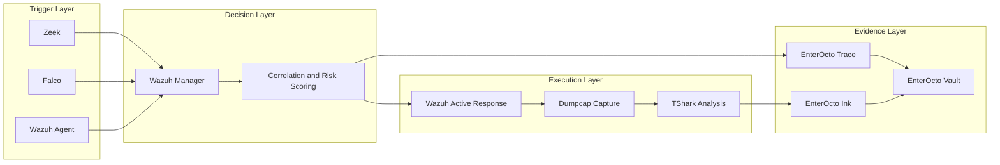

<div align="center">

# EnterOcto

### AI Agent 可觀測性、證據保存與治理

**在脈絡消失以前，讓未納管的 AI Agent 活動變得可觀測、可解釋、可稽核。**

</div>

<p align="center">
  <a href="LICENSE"></a>
  
  
</p>

<p align="center">
  
</p>

語言版本：[English](README.md) | [繁體中文（台灣）](README.zh-TW.md)

> [!IMPORTANT]
> EnterOcto 目前是早期階段的開源安全研究與工程專案。  
> 初期重點是 **可觀測性、調查與證據保存**。治理式回應控制規劃於後續階段。

> 本文件為 `README.md` 的台灣正體中文版本。若英文版與中文版內容不一致，請以英文版為準，並開 issue 或 PR 協助同步。

## 總覽

EnterOcto 是一個開源安全平台概念，用於觀測、調查與治理企業環境中的未納管或高風險 AI Agent 活動。

本專案結合網路遙測資料、主機 runtime 事件、關聯規則、自動化證據收集，以及可供事件處理使用的 case records。

初期技術堆疊建立在：

- **Zeek**：用於網路可觀測性與異常連線探索
- **Falco**：用於 Linux runtime 與程序行為偵測
- **Wazuh Agent / Manager**：用於遙測資料收集、警示關聯與風險決策
- **Wazuh Active Response**：用於受控的回應編排
- **Dumpcap**：用於有界限的封包擷取
- **TShark**：用於封包分析與證據檢視

EnterOcto 並不是只靠產品名稱辨識應用程式。它會關聯網路、程序、身分、檔案存取與 runtime 證據，以理解符合未納管 AI Agent 活動特徵的行為。

## 關於 JoyYoungAI

JoyYoungAI 是一間擁有開源整合工程團隊的公司，專注於將成熟的開源元件組合成安全、可維護、可營運的解決方案。

我們的目標不是取代 Zeek、Falco、Wazuh 或 Wireshark 等上游專案。我們的工作重點是：

- 架構與整合設計；
- 安全編排與自動化；
- 部署與升級流程；
- 互通性與證據處理；
- 授權與 attribution 邊界；
- 測試、營運文件與可維護性。

EnterOcto 透過清楚定義的介面連接獨立維護的安全工具，同時保留每個上游專案原本的 license、copyright、trademark 與 attribution 要求。

實務上，JoyYoungAI 並不重新發明每一個輪子。我們選擇成熟的輪子、檢查它們、安全地連接它們、補上控制與文件，並交付一套可營運與維護的整合。

## 授權模型

主要的 **EnterOcto** repository 採用 [Apache License 2.0](LICENSE)。

EnterOcto 的設計是與另行安裝的開源安全工具互通。這些工具原本的 license 保持不變：

| 專案 | 上游 license | EnterOcto 整合邊界 |
|---|---|---|
| Zeek | BSD-style three-clause license | Logs、scripts 與 telemetry interfaces |
| Falco | Apache-2.0 | JSON/runtime telemetry 與 EnterOcto 原創 rules |
| Wazuh | GPL-2.0 | 獨立服務與獨立的 `EnterOcto-Wazuh` repository |
| Wireshark / TShark / Dumpcap | GPL-2.0 | 外部 command-line executables 與 capture output |

Apache-2.0 license 只適用於 EnterOcto 原創素材，除非個別檔案另有聲明。它不會重新授權第三方專案。

主要 repository 不打算重新散布 Zeek、Falco、Wazuh、Wireshark、TShark 或 Dumpcap binaries。整合與散布政策請參閱 [THIRD_PARTY_NOTICES.md](THIRD_PARTY_NOTICES.md) 與 [REPO-SPLIT.md](REPO-SPLIT.md)。

對上游專案的引用僅作為描述用途。除非明確聲明，EnterOcto 並未獲得上游專案或其維護者背書。

## 上游部署指南

EnterOcto 目前是整合原型。它不取代上游專案維護的部署、升級、hardening 或營運指南。

安裝或操作 EnterOcto 所整合的開源元件時，請使用官方文件：

| 元件 | 官方部署或安裝指南 |
|---|---|
| Zeek | [Installing Zeek](https://docs.zeek.org/en/current/install.html) |
| Falco | [Falco setup](https://falco.org/docs/setup/) |
| Wazuh | [Wazuh installation guide](https://documentation.wazuh.com/current/installation-guide/index.html) |
| Wireshark / TShark / Dumpcap | [Building and Installing Wireshark](https://www.wireshark.org/docs/wsug_html_chunked/ChapterBuildInstall.html) |

本 repository 應記錄 EnterOcto 專屬的整合假設、介面、schemas 與證據處理方式。它不應複製或分叉上游部署手冊。

> [!CAUTION]
> Wazuh 表示，除非另有指定，其 GPLv2 license 也適用於內含的 decoders、rules 與 data files。未經授權審查，不得將 Wazuh-native content 複製到 Apache-2.0 core repository。

## 為什麼叫 EnterOcto？

這個名稱結合了：

- **Enter**：enterprise environments、entry points 與 runtime access
- **Octo**：分散式感測、多個協同的 arms，以及多來源可觀測性

架構採用 octopus-inspired model：

| EnterOcto 概念 | 安全功能 |
|---|---|
| Sensors | 觀測網路與主機行為 |
| Cortex | 關聯警示並計算風險 |
| Trace | 建立調查時間軸 |
| Ink | 擷取易消失的 volatile evidence |
| Vault | 保存 artifacts 與 audit records |
| Grip | 套用受治理的回應控制 |

## 目前產品範圍

第一個產品軌道是：

### EnterOcto Trace

**AI Agent 可觀測性與證據**

EnterOcto Trace 的設計目標是：

- 觀測網路與主機遙測資料中的異常 AI-agent-like activity
- 關聯 IP addresses、ports、users、processes、command lines 與 file access
- 在回應動作改變系統行為以前，觸發 targeted packet capture
- 將事件脈絡保存成結構化 evidence package
- 為 security analysts 與 auditors 產出可供調查的 timelines

### 目前重點

```text
Observe → Correlate → Trace → Preserve
```

### 規劃中的下一階段

```text
Assess → Govern → Limit → Remediate
```

## 架構



## 偵測與證據流程

### 1. Sensor — Discovery Layer

EnterOcto 從網路與主機 sensors 接收 observations。

範例訊號：

- 非預期的 WebSocket connections
- 存取異常 API endpoints
- 長時間 outbound connections
- Python、Node.js 或其他 interpreter processes 讀取大量檔案
- 存取 credentials、configuration files、browser data 或 source repositories
- 可疑的 child processes 或 shell execution
- process owner 與被存取資源不一致

### 2. Cortex — Correlation Layer

初期 reference implementation 使用 Wazuh Manager 接收並關聯來自 Zeek、Falco、Wazuh Agent 與其他來源的 alerts。EnterOcto 的長期架構會把 decision engine 視為整合邊界，而不是永久耦合到單一 backend。

Correlation 應考量：

- Host identity
- User 或 service account
- Process ID 與 parent process
- Command line
- Destination IP 與 port
- Connection timing
- File-access volume
- Alert sequence
- Known 或 approved AI-agent inventory

單一 WebSocket connection 或 Python process 不足以將事件視為 confirmed risk。EnterOcto 是圍繞 multi-source evidence 設計。

### 3. Trace — Investigation Layer

EnterOcto Trace 建立 timeline 並連接：

- User
- Host
- Process tree
- Network destination
- Open files
- Commands
- Alerts
- Evidence artifacts

### 4. Ink — Evidence Capture

當 high-risk correlation rule 被觸發時，reference Wazuh Active Response integration 會啟動受控的 evidence workflow。建議設計使用 **Dumpcap 進行有界限的封包擷取**，並使用 **TShark 進行分析**；兩者都應獨立安裝與授權。

初期 capture policy：

- 使用 reviewed event 中選定的 IP address、port 或 interface 作為 filter
- **60 秒**後停止，或
- capture size 約達 **50 MB** 時停止
- 記錄 triggering alert 與 capture parameters
- 為產出的 evidence 計算 cryptographic hash

第一版優先保存證據，讓任何回應動作不會先改變易消失的 volatile system context。

> [!WARNING]
> Full packet capture 可能包含 credentials、tokens、personal data 與 sensitive business traffic。Production deployments 預設應停用 capture，或採用 metadata-only capture，直到已核准的 policy 定義 authorization、interfaces、exclusions、encryption、access control、retention 與 deletion。

### 5. Vault — Evidence Retention

EnterOcto Vault 保存 investigation package 與相關 integrity metadata。

建議 evidence capsule：

```text
case-<case-id>/
├── manifest.json
├── timeline.json
├── wazuh/
│   └── alert.json
├── zeek/
│   ├── conn.log
│   └── websocket.log
├── falco/
│   └── events.json
├── host/
│   ├── process-tree.json
│   ├── command-line.txt
│   ├── open-files.json
│   └── network-sockets.json
├── packet/
│   └── capture.pcapng
└── hashes/
    └── sha256sum.txt
```

### 6. Grip — Governed Response Layer

EnterOcto Grip 是規劃中的 governed response module。

可能動作包含：

- Pause 或 limit 一個 process tree
- 透過 approved controls isolate container 或 workload
- Restrict destination IP 或 domain
- 透過 policy 關閉異常 WebSocket connection
- Rotate 或 revoke exposed API token
- 透過 policy limit 或 disable account
- Isolate unapproved agent skill 或 extension

Automated response 必須由 policy 驅動、在可行情況下可逆，且完整稽核。

## 產品生命週期

| 階段 | 模組 | 目的 | 狀態 |
|---|---|---|---|
| 1 | Sensor | 收集網路與主機訊號 | 初始設計 |
| 2 | Cortex | 關聯遙測資料並計算風險 | 初始設計 |
| 3 | Trace | 建立 timelines 與 investigation context | 目前重點 |
| 4 | Ink | 擷取 PCAP 與 volatile evidence | 目前重點 |
| 5 | Vault | 保存 evidence 與 integrity records | 規劃中 |
| 6 | Grip | Governed response 與 access remediation | 未來 |

## 實作狀態

EnterOcto 目前是設計與早期原型專案。下表區分已文件化架構與可運作實作。

| 能力 | 狀態 |
|---|---|
| Product architecture and lifecycle | 已文件化 |
| License and third-party integration boundaries | 已定義 |
| Zeek detection scripts | 尚未實作 |
| Falco runtime rules | 尚未實作 |
| Wazuh integration pack | 規劃於 `EnterOcto-Wazuh` |
| Controlled Dumpcap/TShark evidence capture | 已包含初始 MVP；預設 dry-run |
| Evidence manifest schema | 已包含初始 Draft 2020-12 schema |
| Investigation timeline schema | 尚未實作 |
| Governed response through EnterOcto Grip | 未來 |

第一個技術里程碑是最小化的 **Ink + Vault** evidence workflow：驗證 event、透過獨立安裝的 capture tool 執行有界限的 packet capture、產生 cryptographic hashes，並建立結構化 evidence manifest。

## Ink + Vault MVP 快速開始

第一個可執行原型會驗證 structured event、建立 evidence case directory、記錄 planned capture command、記錄 capture 與 analysis status、計算 SHA-256 hashes，並寫入符合 [`schemas/evidence-manifest.schema.json`](schemas/evidence-manifest.schema.json) 的 manifest。

Workflow 預設為 **dry-run**，除非同時滿足以下條件，否則不會擷取封包：

1. policy 將 `capture_enabled` 設為 `true`；且
2. command 使用 `--execute` 執行。

需求：

- Linux
- Python 3.11 或更新版本
- 啟用 execution 時需要 Dumpcap 進行 packet capture
- 選擇性 post-capture analysis 需要 TShark

Dry-run 範例：

```bash
python3 scripts/capture/enterocto_capture.py \
  --event examples/sample-event.json \
  --policy config/capture-policy.example.json \
  --output-dir ./evidence
```

執行測試：

```bash
python3 -m compileall scripts tests
python3 -m unittest discover -s tests -v
```

若要在本機或 CI 執行正式 JSON Schema validation tests，請先安裝 `requirements-dev.txt`。

啟用 capture 前，請先閱讀 [SECURITY.md](SECURITY.md) 與 [docs/mvp-ink-vault.md](docs/mvp-ink-vault.md)。

## 範例偵測情境

```text
1. Zeek 觀測到 unknown long-lived WebSocket connection。
2. Falco 偵測到 Python process 正在讀取大量本機檔案。
3. Wazuh Manager 依據 host、time、user 與 process context 關聯兩個事件。
4. Correlation rule 指派 high unmanaged-agent risk score。
5. Wazuh Active Response 啟動 EnterOcto capture script。
6. Dumpcap 記錄最多 60 秒或約 50 MB 的流量。
7. TShark 可分析 resulting capture，而不必以 privileged capture process 身分執行。
8. EnterOcto Trace 建立 investigation timeline。
9. EnterOcto Vault 保存 evidence capsule 與 SHA-256 manifest。
```

## 目前原型檔案

```text
EnterOcto/
├── SECURITY.md
├── CONTRIBUTING.md
├── config/
│   └── capture-policy.example.json
├── docs/
│   └── mvp-ink-vault.md
├── examples/
│   └── sample-event.json
├── schemas/
│   └── evidence-manifest.schema.json
├── scripts/
│   └── capture/
│       └── enterocto_capture.py
└── tests/
    └── test_enterocto_capture.py
```

## 規劃中的 Repository 結構

EnterOcto 採用 license-separated repository model。以下 layout 代表第一個 working prototype 的目標結構；部分檔案與目錄目前尚未存在。

### Main repository: `JoyYoungAI/EnterOcto`

License: **Apache-2.0**

```text
EnterOcto/
├── README.md
├── LICENSE
├── NOTICE
├── THIRD_PARTY_NOTICES.md
├── REPO-SPLIT.md
├── SECURITY.md
├── CONTRIBUTING.md
├── docs/
│   ├── architecture/
│   ├── detection-rules/
│   ├── deployment/
│   └── images/
├── core/
│   ├── correlation/
│   ├── timeline/
│   └── evidence/
├── integrations/
│   ├── zeek/
│   ├── falco/
│   └── tshark/
├── scripts/
│   ├── capture/
│   └── evidence/
├── schemas/
│   ├── evidence-manifest.schema.json
│   └── timeline.schema.json
├── tests/
└── examples/
```

TShark integration 是 external CLI adapter。此 repository 預設不 embed 或 redistribute Wireshark/TShark source code 或 binaries。

### Wazuh integration repository: `JoyYoungAI/EnterOcto-Wazuh`

License: **GPL-2.0-only**

```text
EnterOcto-Wazuh/
├── README.md
├── LICENSE
├── THIRD_PARTY_NOTICES.md
├── decoders/
├── rules/
├── active-response/
├── tests/
└── examples/
```

此獨立 repository 預計放置 Wazuh-native decoders、rules 與 Active Response integration content。它會在 Apache-2.0 EnterOcto Core 與 GPLv2 Wazuh integration material 之間維持清楚邊界。

完整 repository policy 請參閱 [REPO-SPLIT.md](REPO-SPLIT.md)。

## 初期里程碑

### Phase 0 — Project Foundation

- 定義 threat model
- 定義 supported environments
- 定義 evidence schema
- 建立 coding 與 contribution standards
- 加入 responsible disclosure process

### Phase 1 — Detect and Trace

- Zeek event ingestion
- Falco runtime rules
- 定義 GPL-2.0-only 的 `EnterOcto-Wazuh` integration repository
- 在該 repository 實作 Wazuh decoders 與 correlation rules
- Timeline generation
- Case ID creation

### Phase 2 — Preserve

- Targeted Dumpcap capture
- TShark-based packet analysis
- Capture size 與 duration limits
- Evidence manifest generation
- SHA-256 integrity verification
- Evidence retention policy

### Phase 3 — Governed Response

- Process pause 或 limitation
- Destination restriction
- Token rotation 或 revocation hooks
- 透過 approved controls 進行 container isolation
- Approval workflows 與 rollback

### Phase 4 — Enterprise Readiness

- Multi-tenant case management
- RBAC
- Signed evidence manifests
- Policy packs
- Dashboard 與 API
- Compliance mapping

## 非目標

初期版本不以以下事項為目標：

- 只從加密網路流量可靠辨識每一個 AI Agent
- 在沒有核准的 enterprise inspection design 下解密 TLS traffic
- 取代 EDR、NDR、SIEM 或 DFIR platforms
- 預設自動 restrict 所有 unusual processes
- 將每個 Python、Node.js、WebSocket 或 API connection 都視為 malicious
- 在 response controls 實作前，宣稱完整 AI agent governance coverage

## 平台備註

初期 runtime detection design 是 Linux-first，因為 Falco 以 Linux 與 container runtime telemetry 為核心。

未來 Windows 支援可能整合：

- Wazuh Agent
- Sysmon
- Windows Event Log
- ETW
- Microsoft Defender telemetry

## 安全考量

EnterOcto 會處理 sensitive telemetry 與 packet evidence。部署時應套用：

- Least-privilege execution
- Restricted access to packet captures
- Encryption at rest
- Evidence retention limits
- Audit logging
- Integrity verification
- Secrets redaction
- Controlled Active Response permissions
- Tested rollback procedures

請勿以 unrestricted root privileges 執行未經審查的 Active Response scripts。

## 專案狀態

**狀態：** 設計與早期原型

目前沒有穩定或 production-ready 的 EnterOcto release。Repository 現已包含初始 Ink + Vault command-line MVP，但它仍是 reference prototype，不是完整可安裝的安全平台。

公開 roadmap 優先考量 transparent observation logic、reproducible evidence handling 與 safe governed response automation。

Interfaces、schemas、rule formats 與 module names 在第一個 stable release 前都可能變更。

## 參與貢獻

歡迎在以下領域貢獻：

- Zeek scripts 與 detections
- Falco rules
- 透過 `EnterOcto-Wazuh` 提供 Wazuh decoders 與 correlation rules
- Packet-capture safeguards
- Evidence schemas
- Timeline generation
- Test fixtures
- Documentation
- Threat modeling
- Windows telemetry support

提交 production-facing response logic 前，請包含：

- Threat scenario
- Expected telemetry
- False-positive considerations
- Required privileges
- Rollback behavior
- Test evidence

## 負責任揭露

請勿在 public issues 發布 exploitable vulnerabilities、packet captures、credentials、access tokens 或 customer evidence。請遵循 [`SECURITY.md`](SECURITY.md) 中的 private reporting guidance。

## 命名

- **EnterOcto** — project 與 product family
- **EnterOcto Trace** — investigation 與 runtime tracing
- **EnterOcto Ink** — targeted evidence capture
- **EnterOcto Vault** — evidence retention
- **EnterOcto Grip** — future governed response

2026 年 6 月進行 GitHub repository 搜尋時，未發現與 `EnterOcto` 或 `EnterOcto-Trace` 完全相同的 public repository。類似的生物用語如 `enteroctopus` 已被其他地方使用，因此本專案應一致使用精確的 **EnterOcto** 拼法。

## 授權

除非個別檔案另有聲明，此 repository 中的原創內容皆採用 [Apache License 2.0](LICENSE)。

Copyright 2026 JoyYoungAI and EnterOcto contributors.

第三方軟體與整合目標保留其各自 license。EnterOcto 不主張擁有 Zeek、Falco、Wazuh、Wireshark、TShark 或 Dumpcap。

- EnterOcto attribution 請參閱 [NOTICE](NOTICE)。
- 上游專案請參閱 [THIRD_PARTY_NOTICES.md](THIRD_PARTY_NOTICES.md)。
- Apache/GPL repository boundary 請參閱 [REPO-SPLIT.md](REPO-SPLIT.md)。

規劃中的 `EnterOcto-Wazuh` repository 將採用 `GPL-2.0-only`。

---

<div align="center">

**EnterOcto — See every arm. Preserve every trace.**

</div>
