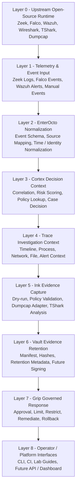
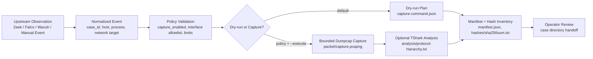
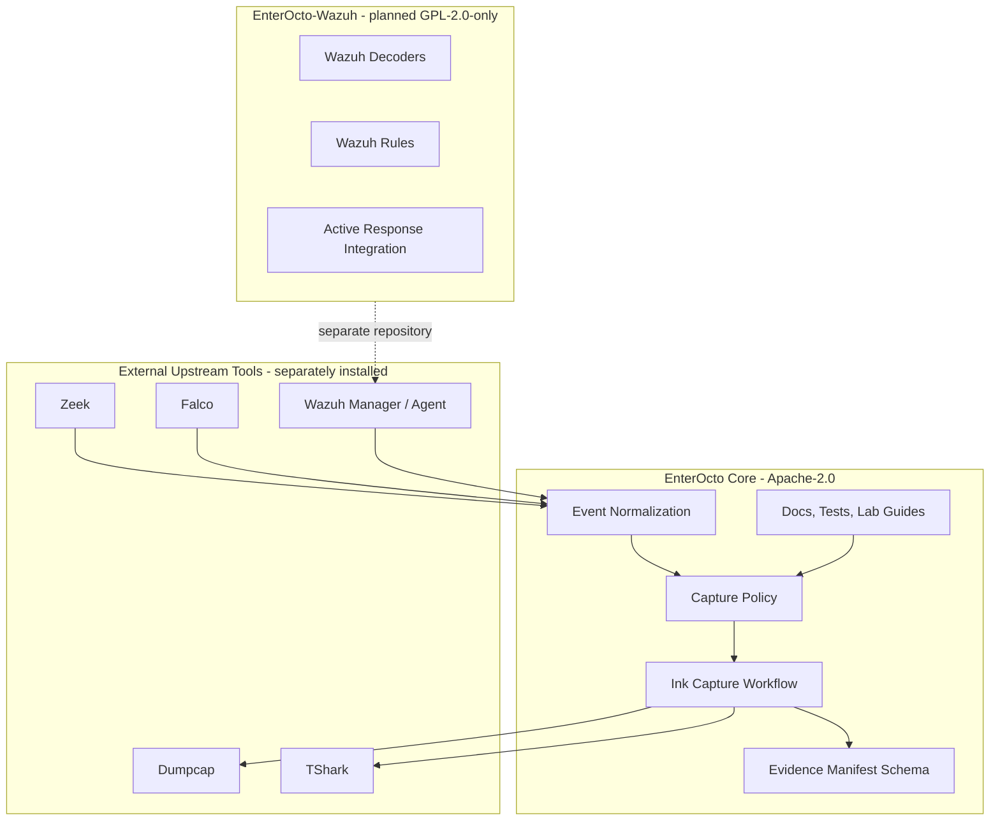

# EnterOcto Architecture Overview

## Purpose

This document describes EnterOcto from a layered stack perspective.

EnterOcto is an integration-oriented security project. It does not replace
Zeek, Falco, Wazuh, Wireshark, TShark, or Dumpcap. Those upstream tools remain
separately installed, licensed, configured, upgraded, and operated.

EnterOcto provides the integration logic around those tools: event shape,
policy validation, controlled evidence capture, manifest generation, hash
inventory, tests, lab guidance, and future governed response workflows.

## Architecture Principles

- Keep upstream tools external and independently maintained.
- Keep the Apache-2.0 EnterOcto core separate from Wazuh-native GPL content.
- Default to dry-run and require explicit authorization for packet capture.
- Treat packet capture as sensitive evidence handling, not routine telemetry.
- Build command arguments from validated fields, not raw user-provided filters.
- Preserve evidence and failure state whenever a case directory exists.
- Record enough metadata for operator review without claiming full chain of
  custody.
- Treat governed response as future work until policy, approval, rollback, and
  audit requirements are defined.

## Stack View

The stack view shows how EnterOcto is intended to sit above upstream open-source
components while keeping each layer's responsibility clear.

## Layer Responsibilities

| Layer | Name | Responsibility | Current status |
|---|---|---|---|
| 0 | Upstream Open-Source Runtime | Provide sensors, managers, packet capture, and packet analysis tools. | External |
| 1 | Telemetry & Event Input | Receive Zeek logs, Falco events, Wazuh alerts, or manual lab events. | Partial sample event |
| 2 | EnterOcto Normalization | Normalize source data into a stable EnterOcto event shape. | Planned |
| 3 | Cortex Decision Context | Correlate signals, score risk, and decide whether a case should be created. | Designed |
| 4 | Trace Investigation Context | Build timelines and connect process, network, file, and alert context. | Designed |
| 5 | Ink Evidence Capture | Validate policy, create dry-run plans, run bounded Dumpcap capture, and optionally run TShark analysis. | Initial MVP |
| 6 | Vault Evidence Retention | Store manifest, hash inventory, artifacts, and future retention metadata. | Initial MVP |
| 7 | Grip Governed Response | Apply approved limit, restrict, remediate, and rollback actions. | Future |
| 8 | Operator / Platform Interfaces | Provide CLI, CI validation, lab guidance, and future API or dashboard surfaces. | Partial |

## Evidence Flow

The current MVP focuses on the evidence path. Dry-run is the default. Real
packet capture requires both policy opt-in and the `--execute` command-line
flag.

## Repository and License Boundaries

EnterOcto keeps upstream tools and license-specific integration content outside
the Apache-2.0 core repository unless a future license review explicitly changes
that boundary.

## Current MVP Scope

The current implementation is limited to Ink + Vault evidence handling:

- structured event input;
- strict capture policy validation;
- dry-run evidence case creation;
- optional bounded Dumpcap execution when policy and CLI both allow it;
- optional TShark analysis after successful capture;
- manifest and SHA-256 inventory generation;
- failure-state recording for capture and analysis;
- JSON Schema validation tests;
- isolated lab guidance.

## Planned Expansion

The following areas are documented as direction, not current working features:

- stable event schema for upstream sources;
- Zeek, Falco, and Wazuh adapter contracts;
- timeline generation;
- approved AI Agent inventory;
- correlation and risk scoring;
- retention metadata beyond hashes;
- manifest signing and trusted timestamps;
- governed response controls through EnterOcto Grip;
- API, dashboard, or multi-tenant case management.

## Recommended Operational Sequence

1. Install and operate upstream tools using official documentation.
2. Export or receive telemetry and alerts from upstream tools.
3. Normalize the event into the EnterOcto event shape.
4. Validate event and capture policy.
5. Run dry-run first.
6. Review the planned command, evidence directory, and policy.
7. In an isolated lab, enable capture with both policy opt-in and `--execute`.
8. Run bounded Dumpcap capture.
9. Run optional TShark analysis.
10. Produce manifest and hash inventory.
11. Hand off evidence for operator review.
12. Consider governed response only after policy, approval, rollback, and audit
    requirements are defined.

## Non-Goals

This architecture does not claim that EnterOcto currently provides:

- a full production deployment platform;
- replacement deployment guidance for upstream tools;
- bundled Zeek, Falco, Wazuh, Wireshark, TShark, or Dumpcap binaries;
- Wazuh-native decoders or rules inside the Apache-2.0 core repository;
- complete detection coverage for every AI Agent;
- automatic response without review and policy controls;
- legal chain of custody for evidence.
